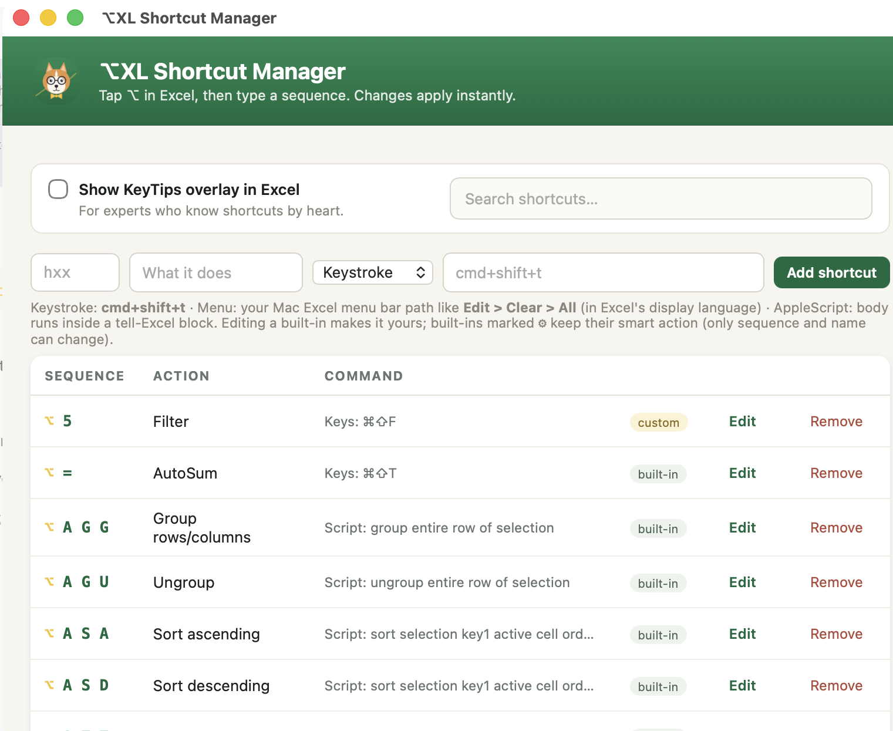

<div align="center">


# ⌥XL

**Windows Alt shortcuts for Excel on Mac.**

Tap the **⌥ Option** key in Excel, then type the sequence you already know from Windows.
`H O I` autofits · `H V V` pastes values · `H B A` draws all borders · `W V G` toggles gridlines

### [⬇ Download for macOS](https://github.com/vitodelcambio/xlalt/releases/latest/download/XL.dmg)

<sub>Apple Silicon &amp; Intel · macOS 12+ · free &amp; open source</sub>

</div>

---

## Why

Excel's ribbon shortcuts are muscle memory for anyone who learned the app on Windows — and they simply don't exist on the Mac. ⌥XL brings them back: one tap of Option enters sequence mode, a KeyTips panel shows what's available as you type, and ~50 built-in sequences map to real Excel actions. Add your own with keystrokes, menu paths, or AppleScript.

## Install

1. **[Download XL.dmg](https://github.com/vitodelcambio/xlalt/releases/latest/download/XL.dmg)**, open it, drag **ExcelAlt** into Applications.
2. Open it. First launch only: macOS blocks apps that aren't notarized — go to **System Settings → Privacy &amp; Security** and click **Open Anyway**.
3. Grant **Accessibility** when the app asks. Shortcuts activate immediately.
4. Open Excel, tap **⌥**, start typing sequences.

Updates after that arrive in-app: **ExcelAlt → Check for Updates**.

## Screenshots

<div align="center">



<sub>The Shortcut Manager — search, edit, and add shortcuts, with every command visible at a glance.</sub>

</div>

## Demo

<!-- TO ADD THE VIDEO:
     1. Open a new Issue in this repo (don't submit it)
     2. Drag your .mp4 into the comment box and wait for upload
     3. Copy the generated https://github.com/user-attachments/assets/... URL
     4. Replace the italic line below with that URL on its own line -->

_Video coming soon._

## Shortcuts

A selection of what ships built in — all editable and searchable in the app:

| Sequence | Action | Sequence | Action |
|---|---|---|---|
| `H V V` | Paste values | `H B A` | All borders |
| `H V F` | Paste formulas | `H B N` | No borders |
| `H O I` | AutoFit column width | `H E A` | Clear all |
| `H O A` | AutoFit row height | `H E C` | Clear contents |
| `H M C` | Merge &amp; center | `H 0` / `H 9` | More / fewer decimals |
| `H W` | Wrap text | `H P` | Percent style |
| `A S A` | Sort ascending | `W F F` | Freeze panes |
| `A T T` | Toggle AutoFilter | `W V G` | Toggle gridlines |

## Custom shortcuts

Three ways to bind a sequence, all from the Shortcut Manager:

- **Keystroke** — replay a combo Excel already knows: `cmd+shift+t`
- **Menu path** — click Excel's macOS menu bar: `Edit > Clear > All`
- **AppleScript** — full automation: `set zoom of active window to 150`

The in-app guide explains each one with examples.

## Development

```bash
lua5.4 tests/run_tests.lua     # 48 tests, no macOS required
bash build/build-app.sh        # build + sign + DMG (macOS only)
```

`src/init.lua` is the engine; `tests/hs_mock.lua` mocks the macOS API so everything runs headless in CI. Pushing a `v*` tag builds the app on a macOS runner, signs an update archive, and publishes the release plus the Sparkle appcast.

**Before touching the event-tap code, read [`docs/ARCHITECTURE.md`](docs/ARCHITECTURE.md)** — tap callbacks hold the system keyboard, so they must never block or touch the window server.

## Known limitations

- **Not notarized** — expect one "Open Anyway" on first launch, and Accessibility must be re-granted after updates. Both disappear with an Apple Developer ID certificate.
- **Menu bar icon** doesn't render on some systems: macOS reports the item as created but never lays it out. The app is fully usable from its window and Dock icon.

## License

MIT. Built on the [Hammerspoon](https://www.hammerspoon.org) runtime (MIT).
