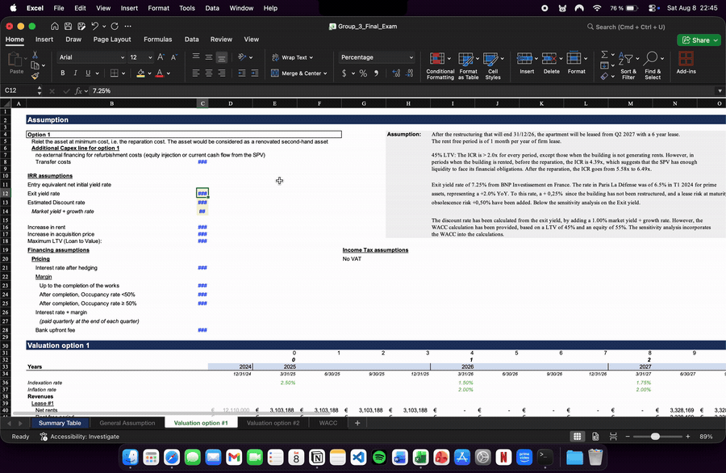
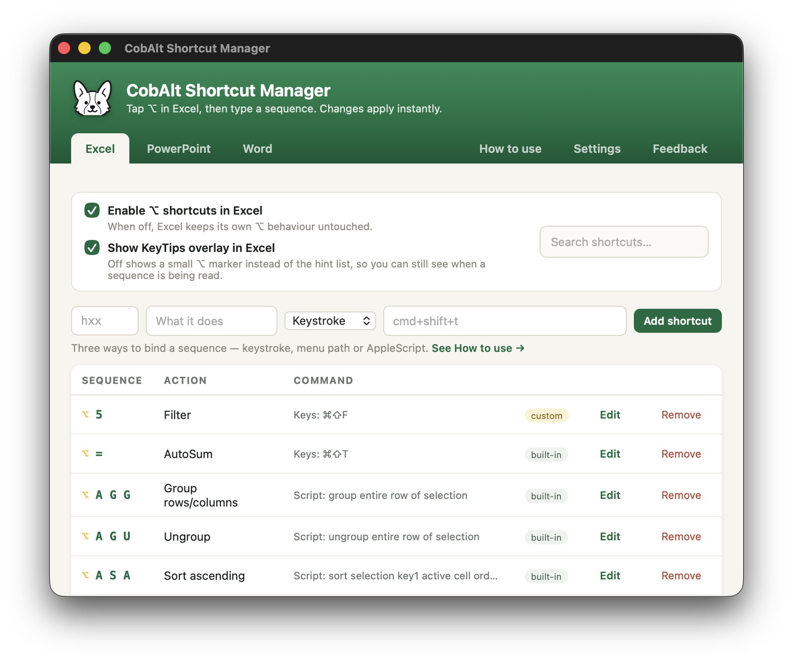
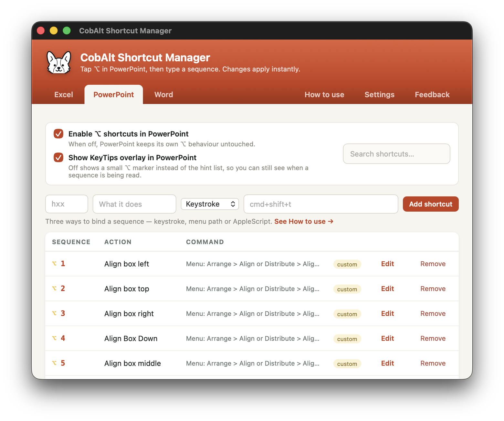
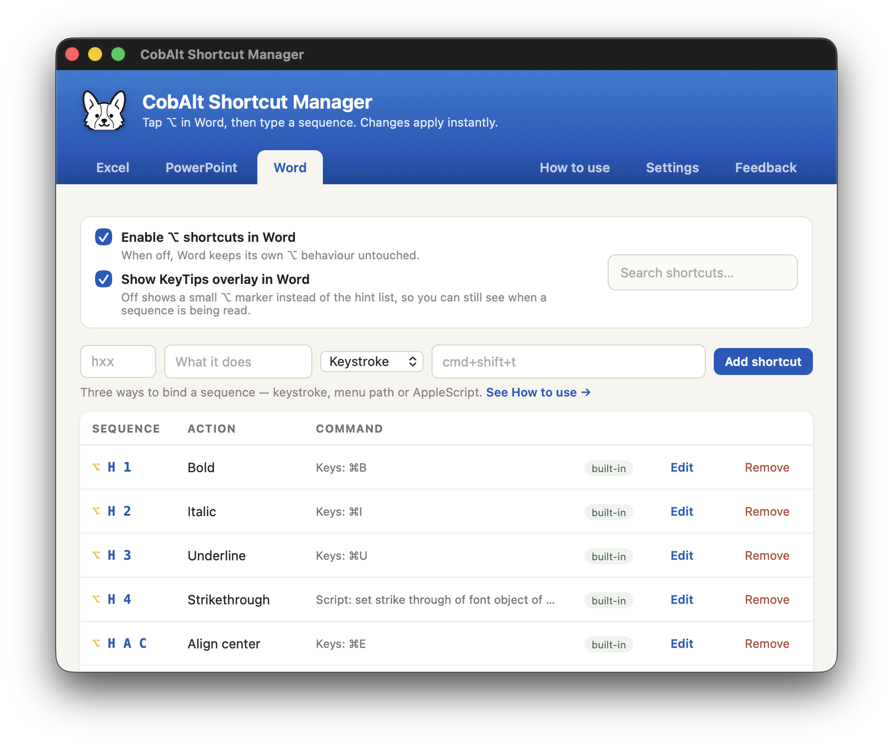
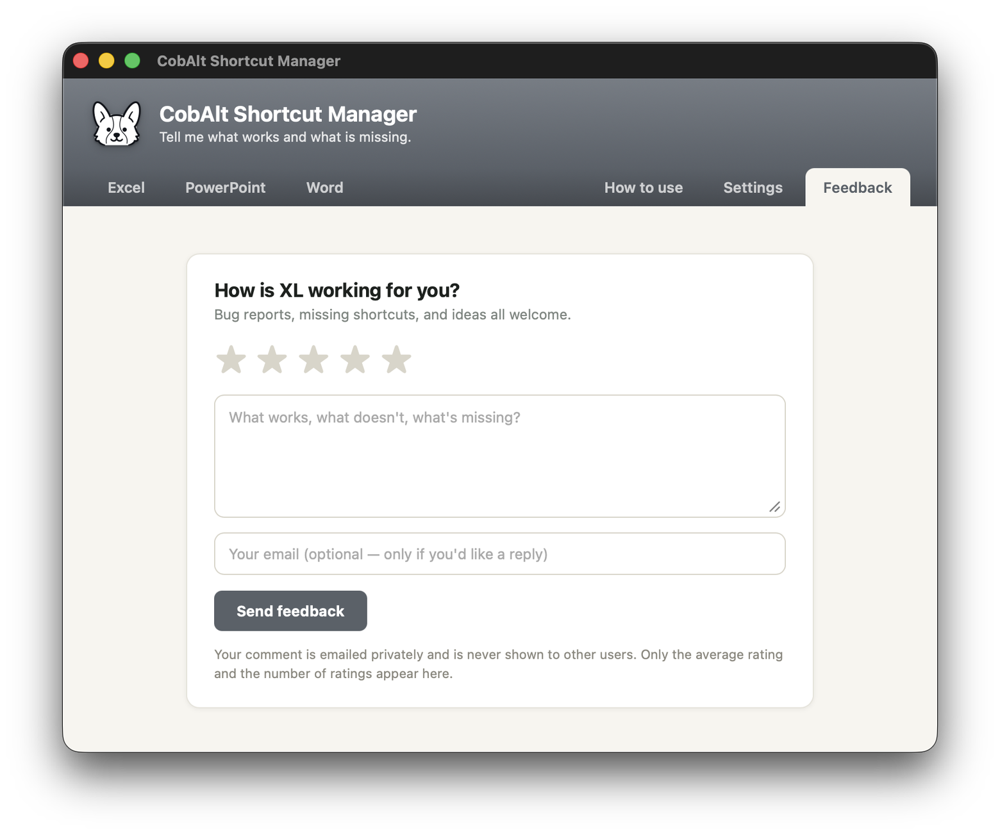

<div align="center">


# CobAlt

**Windows Alt shortcuts for Excel, PowerPoint and Word on Mac.**

Tap the **⌥ Option** key, then type the sequence you already know from Windows.
`H O I` autofits in Excel · `H I` adds a slide in PowerPoint · `H S 2` applies Heading 2 in Word

### [⬇ Download for macOS](https://github.com/continental-vito/xlalt/releases/latest/download/CobAlt.dmg)

<sub>Apple Silicon &amp; Intel · macOS 13+ · free &amp; open source</sub>

[](https://github.com/continental-vito/xlalt/releases)
[](https://github.com/continental-vito/xlalt/releases/latest)
[](https://github.com/continental-vito/xlalt/actions)
[](LICENSE)

</div>

---

## Why

Office's ribbon shortcuts are muscle memory for anyone who learned these apps on Windows — and they simply don't exist on the Mac. CobAlt brings them back across **Excel, PowerPoint and Word**: one tap of Option enters sequence mode, a KeyTips panel shows what's available as you type, and the built-in sequences map to real actions in whichever app is in front. Each app keeps its own list, its own colour, and its own on/off switch. Add your own with keystrokes, menu paths, or AppleScript.

## Install

1. **[Download CobAlt.dmg](https://github.com/continental-vito/xlalt/releases/latest/download/CobAlt.dmg)**, open it, drag **CobAlt** into Applications.
2. Open it. First launch only: macOS blocks apps that aren't notarized — go to **System Settings → Privacy &amp; Security** and click **Open Anyway**.
3. Grant **Accessibility** when the app asks. Shortcuts activate immediately.
4. Open Excel, tap **⌥**, start typing sequences.

Updates after that arrive in-app: the menu bar icon → **Check for Updates**, or **Shortcut Manager → Settings**.

## See it work

<div align="center">



<sub>Tap <b>⌥</b>, the KeyTips panel appears, type the sequence — the action runs.</sub>

<br><br>



<sub>The Shortcut Manager — search, edit and add shortcuts, with every command visible at a glance.</sub>

</div>

## Shortcuts

The same sequence can mean different things in different apps, and the KeyTips panel always says which app it is driving. A selection of what ships built in — all editable and searchable:

**Excel**

| Sequence | Action | Sequence | Action |
|---|---|---|---|
| `H V V` | Paste values | `H B A` | All borders |
| `H V F` | Paste formulas | `H B N` | No borders |
| `H O I` | AutoFit column width | `H E A` | Clear all |
| `H O A` | AutoFit row height | `H E C` | Clear contents |
| `H M C` | Merge &amp; center | `H 0` / `H 9` | More / fewer decimals |
| `H W` | Wrap text | `H P` | Percent style |
| `A S A` | Sort ascending | `W F F` | Freeze panes |
| `A T T` | Toggle AutoFilter | `W V G` | Toggle gridlines |

**PowerPoint**

| Sequence | Action | Sequence | Action |
|---|---|---|---|
| `H I` | New slide | `H G` / `H U` | Group / ungroup |
| `H D` | Duplicate | `H A F` / `H A K` | Bring to front / send to back |
| `H A C` | Align center | `S B` | Play from beginning |
| `H F G` / `H F K` | Grow / shrink font | `S C` | Play from this slide |
| `H C` / `H V` | Copy / paste formatting | `W N` / `W S` | Normal view / slide sorter |

**Word**

| Sequence | Action | Sequence | Action |
|---|---|---|---|
| `H S 1`…`H S 3` | Heading 1–3 | `H V V` | Paste text only |
| `H S N` | Normal style | `N B` | Page break |
| `H F G` / `H F K` | Grow / shrink font | `N F` | Footnote |
| `H X` / `H B` | Superscript / subscript | `R C` | New comment |
| `H A J` | Justify | `R T` | Track changes |

### PowerPoint and Word

Each app gets its own tab, its own colour, its own list, and its own on/off
switch. Turning something off in Excel leaves PowerPoint and Word exactly as
they were.

<div align="center">




</div>

## Custom shortcuts

Three ways to bind a sequence, all from the Shortcut Manager:

- **Keystroke** — replay a combo the app already knows: `cmd+shift+t`
- **Menu path** — click the macOS menu bar: `Edit > Clear > All`
- **AppleScript** — full automation: `set zoom of active window to 150`

The in-app guide explains each one, with examples for the app whose tab you're on. Menu paths must match your copy of Office in its display language, which is why no built-in uses one outside Excel.

## Development

```bash
lua5.4 tests/run_tests.lua     # engine suite, no macOS required
node tests/ui/check.js         # manager UI suite (npm install --prefix tests/ui)
bash build/build-local.sh      # test + build + run a dev build on this Mac
bash build/build-app.sh        # build + sign + DMG, as CI does (macOS only)
```

`src/init.lua` is the engine; `tests/hs_mock.lua` mocks the macOS API and `tests/ui/check.js` drives the manager webview in jsdom, so everything runs headless in CI. Supported apps are declared once in the `APPS` table — adding a fourth means a row there plus a `BUILTINS` set. Work lands on `dev`; pushing a `v*` tag from `main` builds the app on a macOS runner, signs an update archive, and publishes the release plus the Sparkle appcast. Branching, the local test loop, and rollback are covered in **[`docs/DEVELOPMENT.md`](docs/DEVELOPMENT.md)**.

**Before touching the event-tap code, read [`docs/ARCHITECTURE.md`](docs/ARCHITECTURE.md)** — tap callbacks hold the system keyboard, so they must never block or touch the window server.

## Known limitations

- **Not notarized** — expect one "Open Anyway" on first launch, and Accessibility must be re-granted after updates. Both disappear with an Apple Developer ID certificate.

## Feedback

Ratings and comments go through the app itself — **Shortcut Manager → Feedback**.
Comments are emailed privately; only the average rating and the number of
ratings are ever shown.

<div align="center">



</div>

## License

MIT. Built on the [Hammerspoon](https://www.hammerspoon.org) runtime (MIT).
